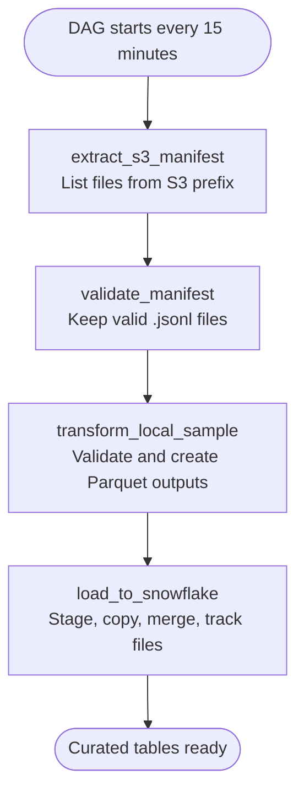
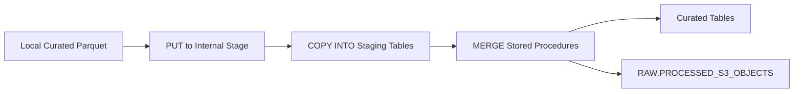

<p align="center">
  <h1 align="center">Tesla Vehicle Telemetry ETL Pipeline</h1>
  <p align="center">
    End-to-end data engineering project for connected vehicle telemetry using S3-style ingestion, Airflow orchestration, Snowflake warehousing, schema validation, data quality gates, and CI.
  </p>
</p>

<p align="center">
  
  
  
  
  
  
</p>

<p align="center">
  
  
  
  
  
</p>

## Overview

This project simulates a production-style telemetry platform for Tesla-like connected vehicles. Raw vehicle events are ingested from S3-style partitioned paths, validated, quality checked, transformed into monitoring-ready datasets, and loaded into Snowflake curated tables through an Airflow DAG.

It is designed as a portfolio-ready data engineering project that demonstrates cloud ingestion, orchestration, warehouse modeling, incremental loading, testing, CI, documentation, and local reproducibility.

## Architecture Diagram

```mermaid
flowchart LR
    vehicle["Vehicle Telemetry<br/>speed, battery, location, alerts"]
    raw["Raw JSONL Files<br/>data/sample/*.jsonl"]
    s3["Amazon S3 Raw Zone<br/>partitioned telemetry path"]
    airflow["Apache Airflow DAG<br/>tesla_telemetry_etl"]
    schema["Pydantic Schema Validation<br/>schemas.py"]
    quality["Data Quality Gates<br/>quality.py"]
    transform["Pandas Transformations<br/>transform.py"]
    parquet["Curated Parquet Files<br/>build/curated"]
    stage["Snowflake Internal Stage<br/>TELEMETRY_INTERNAL_STAGE"]
    staging["Snowflake Staging Tables<br/>STAGING.*"]
    curated["Snowflake Curated Tables<br/>CURATED.*"]
    analytics["Monitoring and Analytics<br/>fleet dashboards"]

    vehicle --> raw --> s3 --> airflow
    airflow --> schema --> quality
    quality --> transform --> parquet
    parquet --> stage --> staging --> curated --> analytics
```



## Airflow DAG Flow



## Snowflake Loading Flow



## Tech Stack

| Layer | Tools | Purpose |
| --- | --- | --- |
| Ingestion | Amazon S3, Boto3 | Discover raw telemetry objects from partitioned paths. |
| Orchestration | Apache Airflow | Schedule and run extract, validate, transform, and load tasks. |
| Validation | Pydantic | Enforce telemetry schema and valid ranges. |
| Quality | Python, Pytest | Detect bad timestamps, duplicate events, invalid alerts, and impossible readings. |
| Transformation | Pandas, PyArrow, Parquet | Build curated telemetry, trip, battery, alert, and hourly datasets. |
| Warehouse | Snowflake | Stage, copy, merge, and query curated monitoring tables. |
| Runtime | Docker Compose | Run Airflow and Postgres locally. |
| CI | GitHub Actions | Run automated test checks on push and pull request. |

## Curated Data Products

| Output | File | Snowflake Table | Business Use |
| --- | --- | --- | --- |
| Telemetry Enriched | `telemetry_enriched.parquet` | `CURATED.TELEMETRY_ENRICHED` | Clean event-level vehicle telemetry. |
| Hourly Metrics | `vehicle_hourly_metrics.parquet` | `CURATED.VEHICLE_HOURLY_METRICS` | Fleet monitoring by VIN and hour. |
| Trip Metrics | `trip_metrics.parquet` | `CURATED.TRIP_METRICS` | Daily movement, distance, and speed metrics. |
| Battery Health | `battery_health.parquet` | `CURATED.BATTERY_HEALTH` | Battery state-of-charge and temperature monitoring. |
| Alerts | `alerts.parquet` | `CURATED.ALERTS` | Operations alert tracking. |

## Repository Structure

```text
.
|-- .github/workflows/ci.yml
|-- dags/tesla_telemetry_etl_dag.py
|-- data/sample/tesla_telemetry_sample.jsonl
|-- docs/
|   |-- architecture.md
|   |-- architecture_flow_diagram.md
|   |-- data_dictionary.md
|   |-- end_to_end_flow.md
|   |-- run_project_end_to_end.md
|   `-- setup.md
|-- scripts/
|   |-- run_end_to_end.py
|   `-- run_local_etl.ps1
|-- snowflake/
|   |-- 001_create_database_schema.sql
|   |-- 002_create_tables.sql
|   `-- 003_curated_models.sql
|-- src/telemetry_etl/
|   |-- config.py
|   |-- extract.py
|   |-- load.py
|   |-- quality.py
|   |-- schemas.py
|   `-- transform.py
|-- tests/
|   |-- test_quality.py
|   `-- test_transform.py
|-- docker-compose.yml
|-- pyproject.toml
|-- requirements.txt
`-- .env.example
```

## Quick Start

```bash
python3 -m venv .venv
source .venv/bin/activate
pip install -e ".[dev]"
pytest
python -m telemetry_etl.transform data/sample/tesla_telemetry_sample.jsonl build/curated
```

Expected outputs:

```text
build/curated/telemetry_enriched.parquet
build/curated/vehicle_hourly_metrics.parquet
build/curated/trip_metrics.parquet
build/curated/battery_health.parquet
build/curated/alerts.parquet
```

## One-Command Runner

Run tests and local ETL:

```bash
python scripts/run_end_to_end.py
```

Run Snowflake setup from `.env` credentials:

```bash
python scripts/run_end_to_end.py --setup-snowflake
```

Load curated Parquet files into Snowflake:

```bash
python scripts/run_end_to_end.py --load-snowflake
```

Run setup, load, and Airflow startup:

```bash
python scripts/run_end_to_end.py --setup-snowflake --load-snowflake --start-airflow
```

## Run Airflow Locally

```bash
cp .env.example .env
docker compose up airflow-init
docker compose up
```

Open Airflow:

```text
http://localhost:8080
```

Login:

```text
username: airflow
password: airflow
```

DAG:

```text
tesla_telemetry_etl
```

## Snowflake Setup

Run the SQL files in order:

```text
snowflake/001_create_database_schema.sql
snowflake/002_create_tables.sql
snowflake/003_curated_models.sql
```

The Snowflake layer creates:

- `TESLA_TELEMETRY` database.
- `RAW`, `STAGING`, and `CURATED` schemas.
- `TELEMETRY_WH` warehouse.
- `TELEMETRY_INTERNAL_STAGE` internal stage.
- `RAW.PROCESSED_S3_OBJECTS` incremental tracking table.
- Staging tables for COPY loads.
- Curated tables for analytics.
- Merge procedures for upserts.

## Environment Variables

Copy:

```bash
cp .env.example .env
```

Fill in:

- `AWS_REGION`
- `AWS_ACCESS_KEY_ID`
- `AWS_SECRET_ACCESS_KEY`
- `S3_BUCKET`
- `S3_PREFIX`
- `SNOWFLAKE_ACCOUNT`
- `SNOWFLAKE_USER`
- `SNOWFLAKE_PASSWORD`
- `SNOWFLAKE_ROLE`
- `SNOWFLAKE_WAREHOUSE`
- `SNOWFLAKE_DATABASE`
- `SNOWFLAKE_SCHEMA`

Do not commit `.env`.

## Validation

```bash
pytest
ruff check .
```

Current status:

```text
6 tests passed
lint clean
local ETL generates curated Parquet files
```

## Documentation

| Document | Purpose |
| --- | --- |
| [docs/setup.md](docs/setup.md) | Full local, AWS, Snowflake, and Airflow setup guide. |
| [docs/run_project_end_to_end.md](docs/run_project_end_to_end.md) | Commands to run the project end to end. |
| [docs/end_to_end_flow.md](docs/end_to_end_flow.md) | Step-by-step flow with file names and completed work. |
| [docs/architecture.md](docs/architecture.md) | Architecture explanation and design notes. |
| [docs/architecture_flow_diagram.md](docs/architecture_flow_diagram.md) | Text-based full architecture diagram. |
| [docs/data_dictionary.md](docs/data_dictionary.md) | Raw fields and curated table definitions. |

## Portfolio Skills Demonstrated

<p>
  
  
  
  
  
</p>

- Cloud object storage ingestion.
- Incremental file processing.
- Schema enforcement and data contracts.
- Data quality gates.
- Curated warehouse modeling.
- Snowflake stage, copy, and merge patterns.
- Airflow DAG design.
- Dockerized local runtime.
- Automated tests and CI.
- Production-style documentation.
